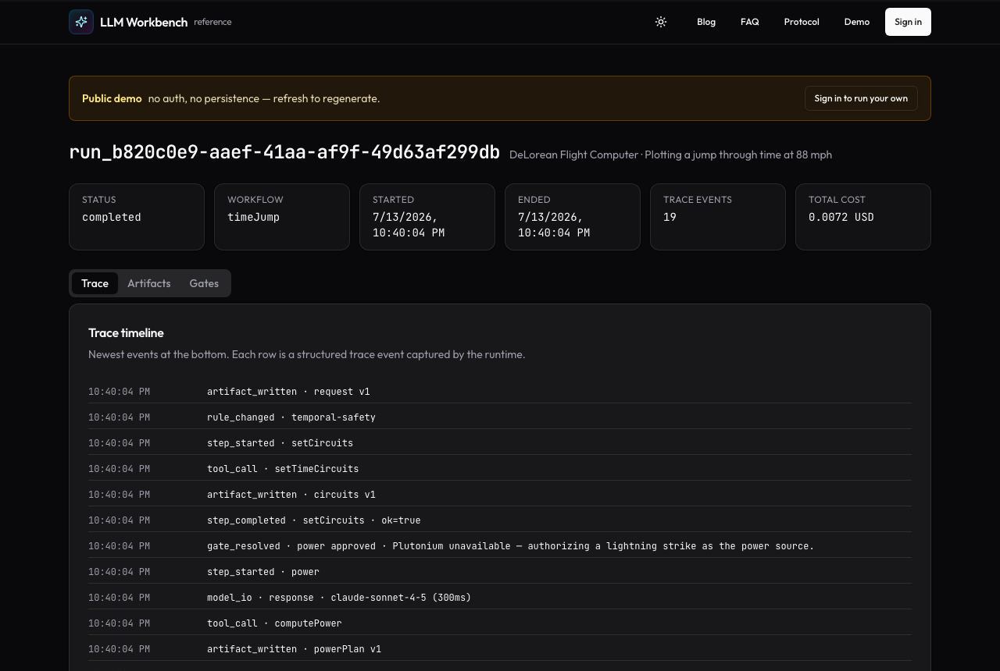

# LLM Workbench

[](https://www.npmjs.com/package/@llm-workbench/runtime)
[](https://github.com/roymcfarland/llm-workbench/actions/workflows/ci.yml)
[](LICENSE)
[](https://nodejs.org)
[](https://codecov.io/gh/roymcfarland/llm-workbench)

**An open-source control plane for LLM-powered products.**

LLM Workbench gives AI applications a production-grade human interface for
the messy parts that matter: workflow state, artifacts, rules, human review
gates, trace history, model I/O, cost telemetry, import/export, and replay.

It is not another chat UI. It is the layer you bolt onto an LLM pipeline when
you want non-technical users to inspect, edit, approve, branch, audit, and
learn from the work your system is doing.

The runtime is headless, model-agnostic, and environment-agnostic. It does not
call OpenAI, Anthropic, local models, or any other provider directly. Your host
application owns prompts, tools, models, and policy. LLM Workbench records what
happened and gives humans a clean control surface over it.

> **License:** [MIT](LICENSE) — free to use, modify, and distribute. The five
> core libraries are published to npm under the
> [`@llm-workbench`](https://www.npmjs.com/org/llm-workbench) scope.

## Status

`v0.3.x` (June 2026): **LLM Workbench is now open source under the MIT License**
and published to npm under the [`@llm-workbench`](https://www.npmjs.com/org/llm-workbench)
scope (five packages: `runtime`, `ui`, `adapters-react`, `ai-sdk`, `mcp`). This
release focused on making the packages genuinely installable and safe to depend on:
a CI smoke test that imports the built packages under plain Node ESM (not just a
bundler), removal of the last `unsafe-eval` from the production CSP by precompiling
JSON-Schema validators at build time, cleared dependency advisories, a
production-scoped audit gate in CI, secret scanning, and packages published with
build provenance. See the launch post:
[llm-workbench-is-now-open-source](https://www.llmworkbench.io/blog/llm-workbench-is-now-open-source).

`v0.2.0` (2026-04-27): the runtime adds Trace 2.0 (hierarchical spans, OTel
GenAI mapper), hierarchical supervision (`runChildrenOf`, `cancelRunCascade`),
and an externalizable `ArtifactStore`; `@llm-workbench/ai-sdk` wraps Vercel
AI SDK v5 with automatic trace events; the UI ships scoped `lwb-` CSS,
accessible `@dnd-kit` reorder, virtualized trace, and a `WorkflowGraph`;
and a hosted reference deployment lands at [`apps/web`](apps/web).
See [CHANGELOG.md](CHANGELOG.md) for the full list.

**Project spec:** [PROJECT.md](PROJECT.md) is the authoritative source of
truth for purpose, scope, non-goals, and the rules that automated reviewers
enforce on every PR.

## See It Live



- **Interactive demo (no signup):** https://www.llmworkbench.io/runs/demo — a
  read-only LLM Workbench run rendered exactly as an authenticated run is.
- **Overview & docs:** https://www.llmworkbench.io · https://www.llmworkbench.io/docs/protocol

## Install

```bash
npm install @llm-workbench/runtime
```

Optional companion packages:

```bash
npm install @llm-workbench/ui @llm-workbench/adapters-react   # React control surface
npm install @llm-workbench/ai-sdk                              # Vercel AI SDK tracing
npm install @llm-workbench/mcp                                 # expose runs over MCP
```

All five libraries are published under the
[`@llm-workbench`](https://www.npmjs.com/org/llm-workbench) scope (MIT, ESM,
Node 22+). The runtime has no React or framework dependency — it runs in the
browser, Node, or edge-style runtimes. Jump to the
[60-second integration](#60-second-integration) for a complete example.

## For Reviewers

If you're reviewing this repo, a useful 15-minute path is:

1. Open the live demo first: https://www.llmworkbench.io/runs/demo.
2. Skim [PROJECT.md](PROJECT.md), then the [Architecture](#architecture)
   section below.
3. Read one representative source file:
   [`packages/runtime/src/runtime/session.ts`](packages/runtime/src/runtime/session.ts).
4. Read one representative test suite:
   [`packages/runtime/src/runtime/workbench.test.ts`](packages/runtime/src/runtime/workbench.test.ts).

## How This Repo Is Built

Most changes are shipped as deliberately small slices. The maintainer
acts as architect/advisor: designing scope, grounding the prompt in repository
recon, catching spec errors, reviewing the implementation, and deciding whether
to merge. A coding agent then implements the scoped PR, and a separate verifier
agent independently checks it against [PROJECT.md](PROJECT.md) with a
structured APPROVE/REJECT verdict.

The process artifacts are there on purpose. [PROJECT.md](PROJECT.md)
is the contract both agents are held to; each slice's build record (closeout)
lives in its PR description. [VERIFIER-AUDIT-PR8.md](docs/process/VERIFIER-AUDIT-PR8.md)
and [VERIFIER-AUDIT-PR10.md](docs/process/VERIFIER-AUDIT-PR10.md) are independent
verification transcripts from specific PRs.

## Why It Exists

LLM apps fail in boring, expensive ways:

- Outputs change and nobody knows why.
- Prompts, rules, artifacts, and human edits drift apart.
- Non-technical reviewers get a black box instead of useful controls.
- Teams cannot replay what happened after a bad run.
- Model spend is logged somewhere, but not where product decisions happen.
- "Add AI" becomes a pile of custom debugging panels and brittle JSON editors.

LLM Workbench turns that chaos into an inspectable run graph.

## How LLM Workbench Compares

LLM Workbench gets compared to LLM observability/tracing tools a lot, since
it also records model calls, cost, and traces. The honest answer is: it's
adjacent to that category, not really competing head-on in it. Three tools
people usually have in mind, and where the real differences are:

**[Helicone](https://helicone.ai)** is a proxy — you point your existing
OpenAI/Anthropic client at Helicone's base URL, and it logs every request on
the way through. Simplest possible integration (change one URL), but it's
fundamentally passive: it observes traffic, it doesn't model your workflow.
LLM Workbench is the opposite shape — no proxy, no network hop, no changed
base URL. You call explicit runtime methods (`writeArtifact`, `logModelIO`,
`resolveGate`) from inside your own code. More integration work up front, but
nothing about your model traffic ever routes through a third party, and the
runtime knows about *steps* and *gates*, not just requests and responses.

**[Langfuse](https://langfuse.com)** is the closest in spirit — open source
(MIT), self-hostable, and it does have "human-in-the-loop" review. But its
human-in-the-loop is for *building eval datasets*: a person annotates past
traces after the fact to create golden examples for scoring future runs.
LLM Workbench's gates (`PAUSE_BEFORE`, `PAUSE_AFTER`, `CHECKPOINT`) are a
runtime primitive, not a post-hoc annotation workflow — a workflow step
*actually stops executing* until `session.resolveGate()` is called. If what
you need is "don't let this step run until a human signs off," that's a
different thing than "let a human grade what already happened," and Langfuse
is built for the latter. Langfuse is also flatly more capable than LLM
Workbench at evaluation — LLM-as-judge scoring, experiment comparison,
prompt management, datasets. LLM Workbench doesn't do any of that and isn't
trying to (see [PROJECT.md's non-goals](PROJECT.md#non-goals) — it's
explicitly not an eval/routing harness).

**[LangSmith](https://smith.langchain.com)** is LangChain's own observability
layer — closed source, tightest integration if you're already deep in
LangGraph, with trajectory replay and a prompt playground that come from
owning the whole stack. If your app is built on LangChain/LangGraph, that
native integration is a real advantage LLM Workbench doesn't try to match.
LLM Workbench is framework-agnostic on purpose — it doesn't know or care
whether you're using LangChain, the Vercel AI SDK, raw provider SDKs, or
something else, at the cost of not getting that same depth of integration
with any one of them.

**What LLM Workbench actually is, then:** not an observability platform, not
an eval harness, not a proxy. It's a headless runtime library for one
specific job: making human review gates, tamper-evident audit trails, and
workflow state a first-class part of how your app runs — not a dashboard
bolted on afterward. `WorkbenchRuntime` and `WorkbenchSession` are things you
embed and call directly; `RunRepository` is pluggable (memory, IndexedDB,
HTTP, or your own backend), so nothing leaves your infrastructure unless you
choose a repository that sends it somewhere. Run bundles are SHA-256 hashed
over canonical JSON specifically so "did a human actually approve this, and
is this export exactly what happened" has a verifiable answer — that's an
audit-trail property, not something the tracing tools above are built
around.

If you need eval scoring, dataset curation, or prompt experimentation,
Langfuse or LangSmith will get you there faster — that's genuinely their job,
not ours. If you need a proxy you can point traffic at with zero code
changes, that's Helicone. If you need a step in your own workflow to
literally not proceed until a human approves it, and a tamper-evident record
of that approval — that's what LLM Workbench is for.

## What You Get

- **Model-agnostic runtime.** The host decides which provider, model, prompt
  strategy, and tool registry to use. The runtime records model I/O and tool
  calls through explicit APIs.
- **Workflow-shaped execution.** Workflows are DAGs with step-level gate
  policies: `AUTO`, `PAUSE_BEFORE`, `PAUSE_AFTER`, and `CHECKPOINT`.
- **Human review gates.** Pause before or after important steps, collect
  approvals, rejections, edits, and notes, then resume with traceable intent.
- **Schema-validated artifacts and rules.** Bring JSON Schemas, validate data
  through Ajv, patch artifacts safely, and export redacted user bundles.
- **Tamper-evident run bundles.** Exports are SHA-256 signed over canonical
  JSON. Imports verify integrity by default.
- **Telemetry-ready traces.** Track provider, model, usage, duration, cost,
  user, tenant, account, and plan metadata without locking into a vendor.
- **Cost and usage summaries.** `summarizeModelTelemetry` turns raw trace
  events into a typed ledger grouped by provider, model, step, user, tenant,
  and plan.
- **Pluggable persistence.** Use memory, IndexedDB, or HTTP behind one
  `RunRepository` interface. The HTTP adapter supports auth headers, timeouts,
  retries, and abort signals.
- **Composable UI.** Use `WorkbenchShell` as a ready-made React control panel,
  or build your own UI against the headless runtime.

## Architecture

```
host app
  owns models, prompts, tools, business logic
  calls runtime APIs as work happens

@llm-workbench/runtime
  records workflow state, artifacts, rules, gates, traces, bundles, telemetry
  runs in browser, Node, or edge-style runtimes

@llm-workbench/ui
  React shell for artifact editing, rules, trace history, gates, import/export

@llm-workbench/adapters-react
  subscription hooks for live runtime state
```

## Repository Layout

```
packages/
  runtime/              @llm-workbench/runtime
  ui/                   @llm-workbench/ui
  adapters-react/       @llm-workbench/adapters-react
  ai-sdk/               @llm-workbench/ai-sdk
  mcp/                  @llm-workbench/mcp (MCP server + HTTP adapter)
examples/
  job-search-demo/    Vite demo app exercising the full surface
  run-repo-server/    Reference REST store for HttpRunRepository
apps/
  web/                Hosted reference deployment (Next.js + Supabase + AI Gateway + Clerk)
```

| Package | What it gives you |
| --- | --- |
| `@llm-workbench/runtime` | Protocol types, `WorkbenchRuntime`, `WorkbenchSession`, `SchemaRegistry`, persistence adapters, bundle import/export, telemetry summaries, and structured `WorkbenchError`. |
| `@llm-workbench/ui` | `WorkbenchShell`, a themeable React interface for artifacts, rules, traces, gates, and bundles. |
| `@llm-workbench/adapters-react` | `useWorkbenchRunRevision` for subscribing React components to live run state. |
| `@llm-workbench/ai-sdk` | Vercel AI SDK v5 wrappers (`tracedGenerateText`, `tracedStreamText`, `tracedGenerateObject`, `tracedStreamObject`, `traceTools`) that emit correlated `model_io`, `tool_call`, and gateway-cost trace events automatically. |
| `@llm-workbench/mcp` | Model Context Protocol server factory plus HTTP handler (`createWorkbenchMcpHttpHandler`) for exposing the runtime over MCP — see [`packages/mcp/README.md`](packages/mcp/README.md). |

## Local Development

To work on the monorepo itself (rather than consume the published packages),
clone it and run:

```bash
npm install
npm test
npm run build
npm run demo               # Vite demo app at http://localhost:5173
npm run demo:http-server   # Reference REST store for HttpRunRepository
```

Node.js **22+** is required (`engines` in root `package.json`). CI runs on **Node 22 and 24** (`.github/workflows/ci.yml`). See [CONTRIBUTING.md](CONTRIBUTING.md) to get involved.

## 60-Second Integration

```ts
import {
  WorkbenchRuntime,
  SchemaRegistry,
  registerDemoSchemas,
  summarizeModelTelemetry,
} from "@llm-workbench/runtime";

const registry = new SchemaRegistry();
registerDemoSchemas(registry);

const runtime = new WorkbenchRuntime();
const { runId } = runtime.startRun({
  workflow: {
    id: "my-pipeline",
    version: 1,
    steps: [
      { id: "parse", gatePolicy: "PAUSE_BEFORE" },
      { id: "score", gatePolicy: "AUTO" },
    ],
    edges: [{ id: "e1", from: "parse", to: "score" }],
  },
  subject: {
    userId: "user_123",
    tenantId: "team_456",
    planId: "pro",
  },
});

const session = runtime.session(runId);

session.resolveGate({
  stepId: "parse",
  gate: "PAUSE_BEFORE",
  decision: "approved",
});

session.beginStep("parse");

session.writeArtifact({
  artifactKey: "compiledProfile",
  typeId: "compiledProfile",
  data: {
    headline: "TypeScript engineer",
    skills: ["typescript", "react", "systems"],
    summary: "Strong full-stack builder with AI workflow experience.",
  },
});

session.logModelIO({
  stepId: "parse",
  direction: "response",
  provider: "openai",
  model: "gpt-example",
  usage: { inputTokens: 120, outputTokens: 40 },
  cost: { amount: 0.0012, currency: "USD" },
  durationMs: 900,
});

session.completeStep("parse");

const telemetry = summarizeModelTelemetry(session.snapshot());
console.log(telemetry.totals, telemetry.byProviderModel);
```

Drop the shell anywhere in your app:

```tsx
<WorkbenchShell runtime={runtime} runId={runId} registry={registry} />
```

## Runtime Principles

- The runtime never hides state behind provider-specific abstractions.
- Structured outputs should be schema-validated before they become product
  state.
- Human edits and approvals are first-class trace events, not side notes.
- Exported runs should be useful for debugging, audits, demos, and learning.
- Model telemetry should be close enough to the workflow that cost and quality
  can be managed together.
- The public protocol should be boring, explicit, and durable.

## License

LLM Workbench is released under the **[MIT License](LICENSE)** — free to use,
modify, and distribute, including commercially. The same license applies to every
package under `packages/*`.

## Contributing

Contributions are welcome. Open an issue to discuss a change or report a bug via
[GitHub Issues](https://github.com/roymcfarland/llm-workbench/issues), and see
[CONTRIBUTING.md](CONTRIBUTING.md) for local setup and the PR process. Please also
read the [Code of Conduct](CODE_OF_CONDUCT.md).

## Security

Please report security issues through the process in [SECURITY.md](SECURITY.md).
